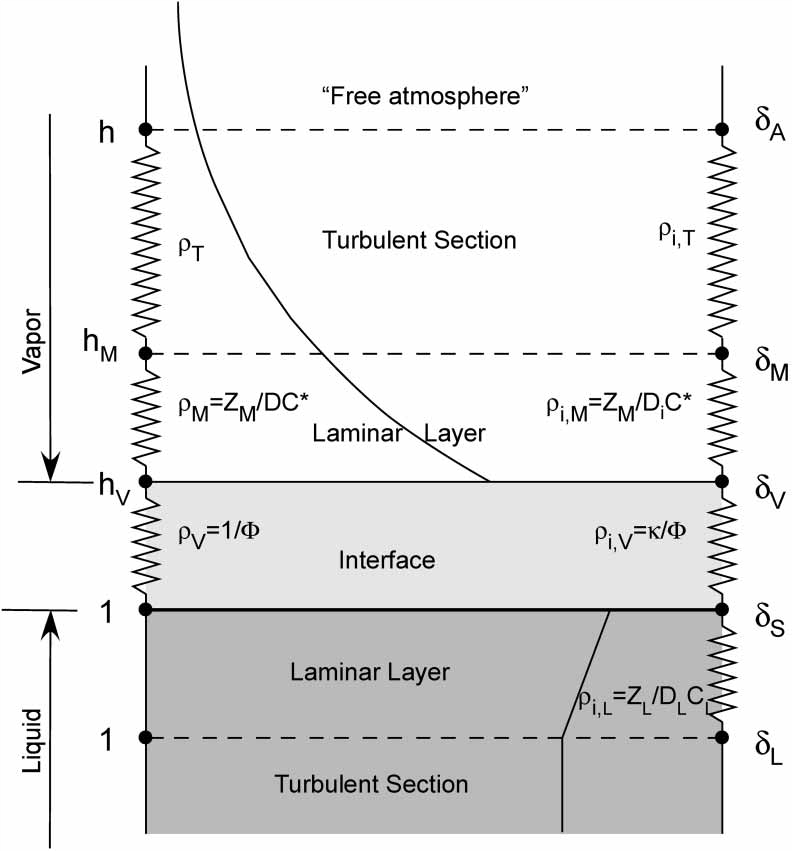

```{r "load packages", include=FALSE}
library(tidyverse)
library(latex2exp)
knitr::opts_chunk$set(eval = FALSE)
```

### maybe use plotly 

# Setting up the model


## Base plot

```{r}
#' @param e_s Saturation Vapor Pressure
#' @param vpd vapor pressure deficit
#' @param t_a Air temperature
#' @param e_a Vapor pressure
#' @param RH Relative humidity
#' @param E Overall flux of water between water surface and the bottom of a free air mass
#' @param del_e Isotopic composition of the evaporative flux
#' @param alpha_vl Equilibrium isotope fractionation at the vapor-liquid interface
#' @param del_l Isotopic composition of liquid water
#' @param del_a Isotopic composition of the "free atmosphere"
#' @param eps_k Bundled total kinetic isotope effects from water vapor transport
#' @param r_m Laminar layer
#' @param r_t Turbulent layer
#' @param d Diffusion coefficients of isotopic water species in air
#' @param theta Water content of soil
#' @param c_k 
#' @param n soil thickness
#' @param 
#' @param 
#' @param 
#' @param 

# calc_dole_effect <- function(f_m, eps_pm, eps_rm, eps_pl, eps_rl, eps_ex, eps_evap, eps_meteoric, strat_flux_m) {
  # f_m * (eps_pm - eps_rm) + (1 - f_m) * (eps_meteoric + eps_evap + eps_pl - eps_rl) + strat_flux_m * eps_ex }

# base plot we will use for plotting
base_plot <- ggplot() + 
  aes(x = t_a, y = e_s) +
  geom_line() + 
  scale_x_continuous(name = "temperature", labels = function(x) paste(100*x, "%"), expand = c(0,0)) +
  theme_gray()
  
base_plot 
```

## Here are the equations in full:

# Temperature Effect:
# Saturation Vapor Pressure of pure water $e_s(T)$:
  

$$
\begin{aligned}
e_s(T) &= f (a \cdot exp [\frac{bT}{c+T}]) \\
& Where \\
a &= 611.21 \\
b &= 17.502 \\
c &= 240.97 \\
f &= 1.0007 + 3.46 \times 10 ^ {-8} P
\end{aligned}
$$
How does temperature change the saturation vapor pressure?

```{r}
df_s <- data_frame(
  a = 611.21,
  b = 17.502,
  c = 240.97,
  f = 1.007 + 3.46 * 10 ^ (-8),
  t_a = seq (from = 0, to = 100, by = 1),
  e_s = f * (a * exp((b * t_a - a)/(c + t_a)))

)
df_s
base_plot %>% df_s
```


```{r}
data_frame(
  Temp.C = seq(0, 374),
  es = calc_es(calc_Temp.K(Temp.C))
) %>% 
  ggplot() + aes(Temp.C, es/100) +
  geom_line() + 
  labs(y = "saturation vapor pressure [mbar]") 
```
  
  


# Vapor Pressure Deficit [VPD]:
$$
\begin{aligned}
e_s(T_a) - e_a &= VPD \\
e_s(T_a) - e_a &= e_s(T_a)(1 - \frac{RH}{100%})


\end{aligned}
$$


# Overall Flux:


```{r out.width = "80%", echo=FALSE, eval=TRUE}
 
```


$$
\begin{aligned}
E &\propto \frac{1-h}{r} \\
r &= r_M + r_T
\end{aligned}
$$
  

# Evaporation Flux:
  
  
$$
\begin{aligned}
\delta_E &= \frac{\alpha_{\frac{V}{L}} \cdot \delta_L - h \cdot \delta_A - (\epsilon* + \epsilon_K)}{(1-h) + 10 ^ {-3} \epsilon_K} \\
\epsilon_K &= (1 - \alpha_K) 10^3 > 0 \\
\delta_E &= \textrm{ isotopic composition of evaporating vapor} \\
\delta_L &= \textrm{ isotopic composition of liquid water}\\
\delta_A &= \textrm{ isotopic composition of the "free atmosphere"}\\
\end{aligned}
$$

  

  
# Diffusion Flux:

  
  
$$
\begin{aligned}
\epsilon_K &= (1-h)\frac{r_M}{r}(1 - \frac{r_M,i}{r_M})10^3 \\
i & \textrm{ denotes the heavy isotope}

\end{aligned}
$$
  
  
# Diffusion Flux 2.0:

$$
\begin{aligned}
\epsilon_K &= (1-h)\frac{r_M}{r}[1 - (\frac{D_i}{D})^n]10^3 \\
(1-h)\frac{r_M}{r}[1 - (\frac{D_i}{D})^n]10^3 &\approx \theta \cdot (1 - h) \cdot n \cdot (1 - \frac{D_i}{D}10^3) \\
\theta \cdot (1 - h) \cdot n \cdot (1 - \frac{D_i}{D}10^3) &= \theta \cdot (1 - h) \cdot C_K \\
& Where \\
C_K &= n (1 - \frac{D_i}{D})10^3 \\
\theta &= \frac{r_M}{r}
\end{aligned}
$$
  

  
  

# Equilibrium Isotope Fractionation at the water-air interface [0 - 100C]
  
$$
\begin{aligned}
10^3 ln\alpha_\frac{L}{V}(\frac{^{18}O}{^{16}O}) &= -2.0667 - 0.4156(\frac{10^3}{T}) + 1.137(\frac{10^6}{T^2}) \\

\end{aligned}
$$


# Isotope Fractionation for 0 - 374C
$$
\begin{aligned}
10^3 ln\alpha_\frac{L}{V}(\frac{^{18}O}{^{16}O}) &= -7.685 + 6.7132(\frac{10^3}{T}) - 1.6664(\frac{10^6}{T^2}) + 0.35041(\frac{10^9}{T}) \\

\end{aligned}
$$


