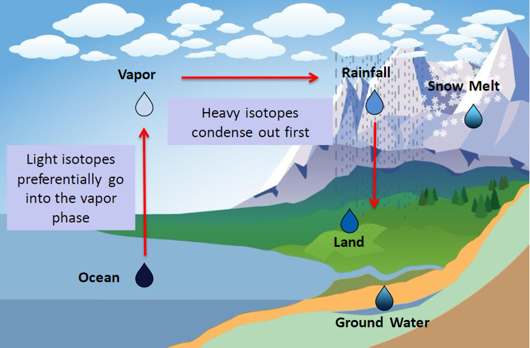

```{r "load packages", include=FALSE}
library(tidyverse)
library(latex2exp)
knitr::opts_chunk$set(eval = FALSE)
```
### Setting up the model

## Base plot

```{r}
#' @param e_s Saturation Vapor Pressure
#' @param vpd vapor pressure deficit
#' @param t_a Air temperature
#' @param e_a Vapor pressure
#' @param rh Relative humidity
#' @param E Overall flux of water between water surface and the bottom of a free air mass
#' @param del_e Isotopic composition of the evaporative flux
#' @param alpha_vl Equilibrium isotope fractionation at the vapor-liquid interface
#' @param del_l Isotopic composition of liquid water
#' @param del_a Isotopic composition of the "free atmosphere"
#' @param eps_k Bundled total kinetic isotope effects from water vapor transport
#' @param r_m Laminar layer
#' @param r_t Turbulent layer
#' @param d Diffusion coefficients of isotopic water species in air
#' @param theta Water content of soil
#' @param c_k 
#' @param n soil thickness
#' @param eps
#' @param eps_k
#' @param eps_kimp
#' @param rmi
#' @param theta
#' @param alpha
#' @param lna

# base plot we will use for plotting
base_plot <- ggplot() + 
  aes(x = t_a, y = e_s) +
  geom_line() + 
  theme_gray()
```

```{r out.width = "80%", echo=FALSE, eval=TRUE}
 
```


## Temperature Effect: Saturation Vapor Pressure of pure water $e_{s(T)}$:


$$
\begin{aligned}
e_s(T) &= f (a \cdot exp [\frac{bT}{c+T}]) \\
& Where \\
a &= 611.21 \\
b &= 17.502 \\
c &= 240.97 \\
f &= 1.0007 + 3.46 \times 10 ^ {-8} P
\end{aligned}
$$

# Question 1:
How does temperature change the saturation vapor pressure? Do you expect a higher saturation vapor pressure at higher or lower temperatures? Why?


```{r}
# Plug in constants from equation
# P = 1 atm = 101325 Pa
# Vary temperature from -20 - +45
  a <- 611.21
  b <- 17.502
  c <- 240.97
  p <- 101325
  f <- (1.0007 + (3.46 * 10 ^ (-8) * p))
df_s <- data_frame(
  t_a = seq (from = -20, to = 45, by = 1),
  e_s = f * (a * exp((b * t_a)/(c + t_a)))
)

base_plot %+% df_s %+% aes(x = t_a, y = e_s) %+% scale_x_continuous(name = "Temperature [C]") +
  scale_y_continuous(name = "Saturation Vapor Pressure [Pa]") 
```


## Vapor Pressure Deficit [VPD]:
$$
\begin{aligned}
e_s(T_a) - e_a &= VPD \\
e_s(T_a) - e_a &= e_s(T_a)(1 - \frac{RH}{100%})
\end{aligned}
$$
VPD is the difference between ambient vapor pressure and vapor pressure at saturation. It is proportional to the rate of evaporation.

# Question 2A:
Assuming a constant relative humidity, how does the VPD change with temperature?


# Question 2B:
Assuming a constant temperature, how does the VPD change with relative humidity?


```{r}
# Use expand.grid so you can vary both temperature and relative humidity
df_vpd <- expand.grid(
  rh = seq (from = 0, to = 100, by = 1),
  t_a = seq (from = -20, to = 45, by = 5)
) %>% 
  # Mutate df_vpd to then calculate e_s and vpd
  mutate(
    e_s = f * (a * exp((b * t_a)/(c + t_a))),
    vpd = e_s * ( 1 - (rh / 100))
  )

base_plot %+% df_vpd %+% aes(x = rh, y = vpd, color = t_a, group = t_a) %+% scale_x_continuous(name = "Relative Humidity") + scale_color_gradient (low = "blue", high = "red") +
  scale_y_continuous(name = "Vapor Pressur Deficit") 
```
## Overall Flux:

```{r out.width = "80%", echo=FALSE, eval=TRUE}
knitr::include_graphics("atm_layers.png") 
```


The overall flux describes the flux of water between the water surface and the bottom of the free air above the turbulent layer.

$$
\begin{aligned}
E &\propto \frac{1-h}{r} \\
r &= r_M + r_T
\end{aligned}
$$

# Question 3:
How does the total flux change with different rt and rm values? How about relative humidity?


$$
\textrm{From the following source, assume:} \\
\begin{aligned}
\textrm{alpha} &= 0.98 \\
\textrm {rm} &= 0.67 \\
\end{aligned} \\
$$
$\href{https://xleelab.sites.yale.edu/sites/default/files/files/kim1.pdf}{\textrm{Isotopic enrichment of liquid water during evaporation from water surfaces}}$

```{r}
# Use 0.67 for rm, and assume an rt value
# normalize the relative humidity by using the above relationship
df_e <- data_frame (
  rm = 0.67,
  rt = 0.5,
  rh = seq (from = 0, to = 100, by = 1),
  alpha = 0.98,
  rh_norm = rh / alpha,
  r = rm + rt,
  e = (1 - rh_norm / 100) / r 
)

base_plot %+% df_e %+% aes(x = rh_norm, y = e) %+% scale_x_continuous(name = "Relative Humidity") +
  scale_y_continuous(name = "Total Flux") 

```

## Evaporation Flux: $\delta_e$

$$
\begin{aligned}
\delta_E &= \frac{\alpha_{\frac{V}{L}} \cdot \delta_L - h \cdot \delta_A - (\epsilon* + \epsilon_K)}{(1-h) + 10 ^ {-3} \epsilon_K} \\
\epsilon_K &= (1 - \alpha_K) 10^3 > 0 \\
\delta_E &= \textrm{ isotopic composition of evaporating vapor} \\
\delta_L &= \textrm{ isotopic composition of liquid water}\\
\delta_A &= \textrm{ isotopic composition of the "free atmosphere"}\\
\end{aligned}
$$

$$
\textrm{Using values from Craig and Gordon, 1965:} \\
\begin{aligned}
\textrm{alpha_vl} &= 0.991 \\
\textrm{alpha_k} &= 0.995 \\
\textrm{eps_vl} &= 9 \\
\textrm{e_k} &= 5 \\
\textrm{Assume:} \\
\textrm{del_l} &= 0 \\
\textrm{del_a} &= -12, -20
\end{aligned}
$$

# Question 4A:
How does the starting delta value of the atmosphere combined with the relative humididty affec the delta of the evaporated water?


# Question 4B:
What happens at very high relative humidities?
What happens if the starting delta values are changed [E.G. $\\delta_a =$ -5]?


```{r}
# Use expand.grid again to vary rh and have 2 values for del_a
# First have rh range from 0 - 75
df_dele <- 
  expand.grid(
    rh = seq (from = 0, to = 75, by = 1),
    del_a = c(-12, -20)
  ) %>% 
  mutate(
    alpha_vl = 0.991,
    alpha_k = 0.995,
    del_l = 0,
    eps_vl = 9,
    e_k = 5,
    del_e = (alpha_vl * del_l - rh / 100 * del_a - (eps_vl + e_k)) / ((1 - rh / 100) + e_k * 0.001)
)
base_plot %+% df_dele %+% aes(x = rh, y = del_e, color = factor(del_a)) %+% scale_x_continuous(name = "Relative Humidity") +
  scale_y_continuous(name = latex2exp::TeX("$\\delta_e$"))
```
## Improved $\epsilon_k$

$$
\begin{aligned}
\epsilon_K &= (1-h)\frac{r_M}{r}(1 - \frac{r_{M,i}}{r_M})10^3 \\
i & \textrm{ denotes the heavy isotope}
\end{aligned}
$$

$$
\textrm{Assume:} \\
\begin{aligned}
\frac{r_{M,i}}{r_M} &= 0.98 \\
\end{aligned}
$$
# Question 5:
How does $\epsilon_k$ vary with relative humidity? How does $\epsilon_k$? vary with rt?


  
```{r}
# rm is still 0.67
# Choose rt
df_epsk <- data_frame(
  rh = seq (from = 0, to = 100, by = 1),
  rm = 0.67,
  rt = 0.50,
  r = rm + rt,
  rmi = 0.98,
  eps_k = (1 - rh / 100) * (rm / r) * (1 - (rmi)) * 10 ^ 3
)
base_plot %+% df_epsk %+% aes(x = rh, y = eps_k) %+% scale_x_continuous(name = "Relative Humidity") +
  scale_y_continuous(name = latex2exp::TeX("$\\epsilon_k$"))
```

## Diffusion Flux 2.0:

$$
\begin{aligned}
\epsilon_K &= (1-h)\frac{r_M}{r}[1 - (\frac{D_i}{D})^n]10^3 \\
(1-h)\frac{r_M}{r}[1 - (\frac{D_i}{D})^n]10^3 &\approx \theta \cdot (1 - h) \cdot n \cdot (1 - \frac{D_i}{D}10^3) \\
\theta \cdot (1 - h) \cdot n \cdot (1 - \frac{D_i}{D}10^3) &= \theta \cdot (1 - h) \cdot C_K \\
\\
\\
\textrm{Solve: } \ & \epsilon_K = \ \theta \cdot (1 - h) \cdot C_K \\
& Where \\
C_K &= n (1 - \frac{D_i}{D})10^3 \\
\theta &= \frac{r_M}{r} \\
\frac{D_i}{D} &= \frac{M}{M_i} ^ {1/2} \\
\end{aligned}
$$

```{r}
df_epskimp <- data_frame(
  rh = seq(0, 100, by = 1),
  n = 1 / 2,
  d = (18 / 20) ^ (1 / 2), 
  c_k = n * (1 - d) * 10 ^ 3,
  rm = 0.67,
  rt = 0.8,
  r = rm + rt,
  theta = rm / r,
  eps_kimp = theta * (1 - rh / 100) * c_k
)
base_plot %+% df_epskimp %+% aes(x = rh, y = eps_kimp) %+% scale_x_continuous(name = "Relative Humidity") +
  scale_y_continuous(name = latex2exp::TeX("$\\epsilon_k$"))
```

# Using the improved $\epsilon_k$ to find $\delta_e$:

# Question 6:
What happens when relative humidity goes above 75%?


```{r}
df_dele_complete <- expand.grid(
  rh = seq (from = 0, to = 75, by = 1),
  del_a = c(-12, -20)
) %>%
  mutate(
  alpha_vl = 0.99,
  alpha_k = (0.9691),
  del_l = 0,
  e_s = (1 - alpha_vl) * 10 ^ 3,
  n = 1 / 2,
  d = (18 / 20) ^ (1 / 2),
  c_k = n * (1 - d) * 10 ^ 3,
  rm = 0.67,
  rt = 0.8,
  r = rm + rt,
  theta = rm / r,
  eps_kimp = theta * (1 - rh / 100) * c_k,
  del_e = (alpha_vl * del_l - rh / 100 * del_a - (e_s + eps_kimp)) / ((1 - rh / 100) + (10 ^ (-3)) * eps_kimp)
)
base_plot %+% df_dele_complete %+% aes(x = rh, y = del_e, color = factor(del_a)) %+% scale_x_continuous(name = "Relative Humidity") +
  scale_y_continuous(name = latex2exp::TeX("$\\delta_e$"))
```

# Equilibrium Isotope Fractionation at the water-air interface [0 - 100C]:
  
$$
\begin{aligned}
10^3 ln\alpha_\frac{L}{V}(\frac{^{18}O}{^{16}O}) &= -2.0667 - 0.4156(\frac{10^3}{T}) + 1.137(\frac{10^6}{T^2}) \\
\end{aligned}
$$


```{r}
# Defining the temperature range in Kelvin
df_lna <- data_frame(
  t_a = seq(from = 253.15, to = 323.15, by = 1),
  lna = (-2.0667 - 0.4156 * ((10 ^ 3) / t_a) + 1.137 * ((10 ^ 6) / (t_a ^ 2))) / 1000,
  alpha = (exp(lna))
)
base_plot %+% df_lna %+% aes(x = t_a - 273.15, y = 1/alpha) %+% 
  scale_x_continuous(name = "Temp [C]") +
  scale_y_continuous(name = "alpha", sec.axis = sec_axis(trans = ~(1 - .)*1000, name = "eps"))
  
```